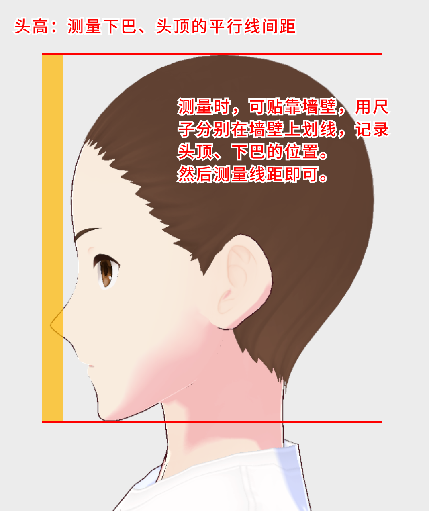
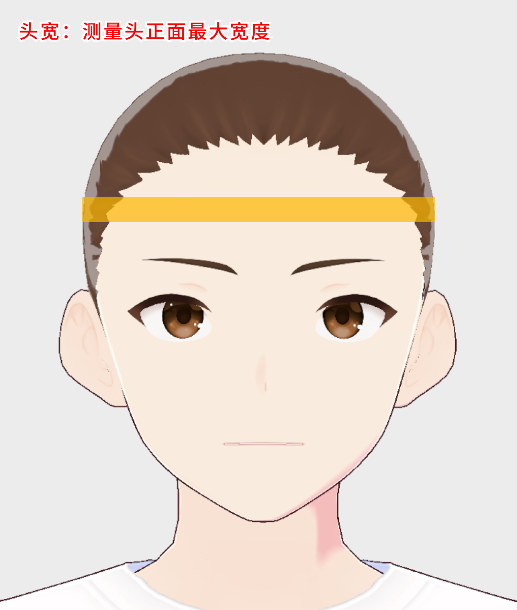
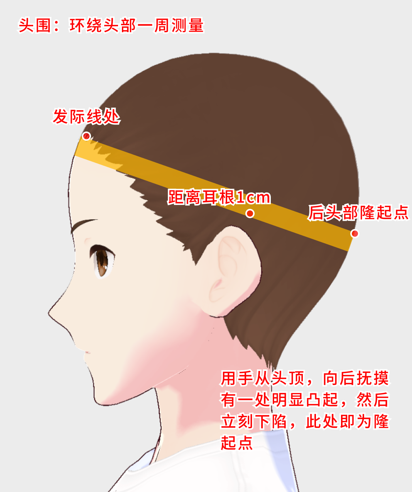
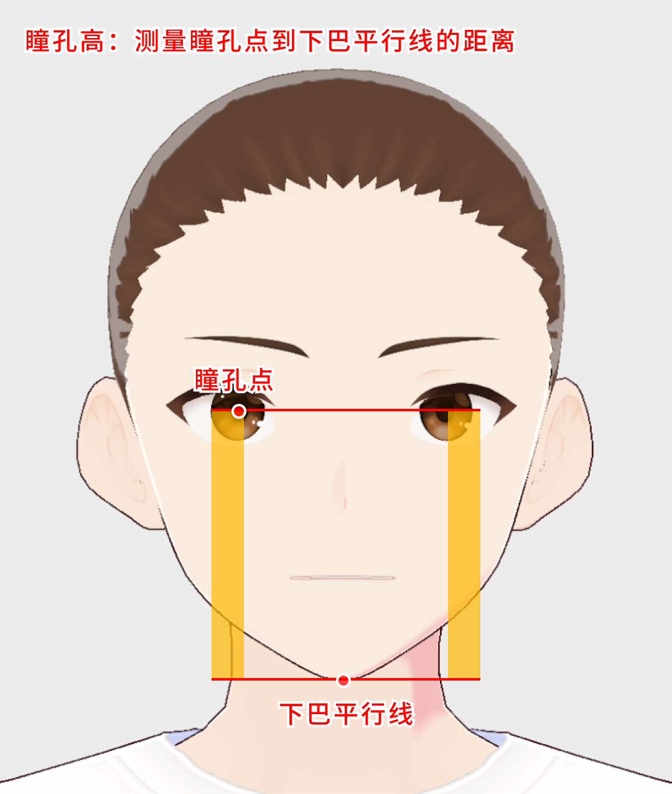
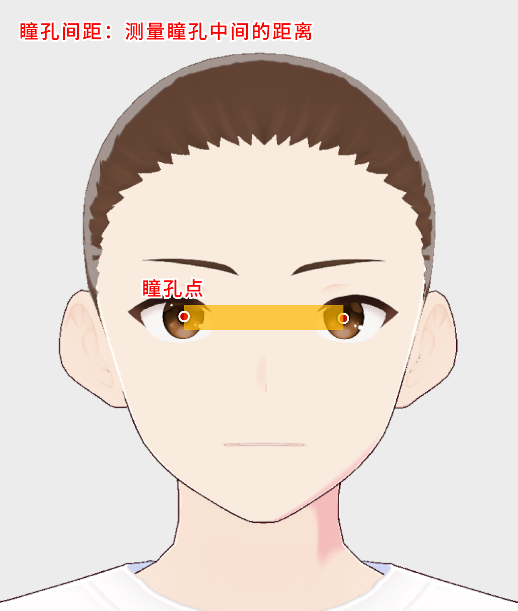
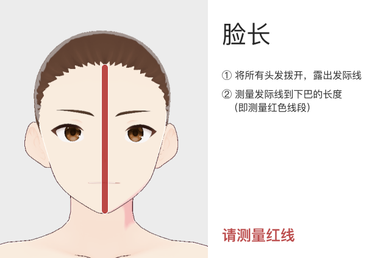
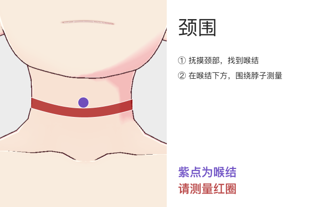

# 测量指南

为了更好的佩戴效果与舒适性，我们可能需要您测量一些数据。

请您根据所购买的产品，测量对应的项目，并向我们的客服提供测量数据。

> ⚠ 请您务必提供准确、未经放大或缩小的数据

## 头壳测量项目

| 序号 | 测量项目         | 说明 |
| ------- | ---------------- | ------- |
| 1    | 头高             |         |
| 2    | 头宽             |          |
| 3    | 头围             |  |
| 4    | 瞳孔高度（眼高） |          |
| 5    | 瞳孔宽度（眼宽） |           |
| 6    | 身高             | 主要用于确认头身比例                                                  |
| 7    | 体重             | 主要用于确认头身比例                                                  |
| 8    | 肩宽             | 辅助确认头身比例                                                      |

## 紧身衣测量项目

| 序号 | 测量项目         | 说明 |
| ------- | ---------------- | ------- |
| 1 | 性别 | 生理性别，用于确认人体曲线（若有 SRS 性别重置术史，请告知客服）。 |
| 2 | 身高 | 脱鞋，直立，头部与墙壁保持垂直，双脚并拢，双肩放松，双臂自然下垂，测量身高。 |
| 3 | 体重 | 以 kg 为单位。 |
| 4 | 脸长 |  |
| 5 | 头围 |  |
| 6 | 颈围 |  |
| 7 | 肩宽 |  |
| 8 | 上身长 |  |
| 9 | 内臂长 |  |
| 10 | 手腕围 |  |
| 11 | 掌围 |  |
| 12 | 中指长 |  |
| 13 | 袖肥 |  |
| 14 | 胸围 |  |
| 15 | 腰围 |  |
| 16 | 臀围 |  |
| 17 | 内腿长 |  |
| 18 | 横档 |  |
| 19 | 脚腕围 |  |

