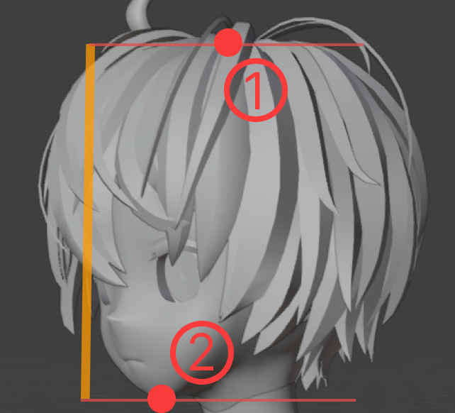
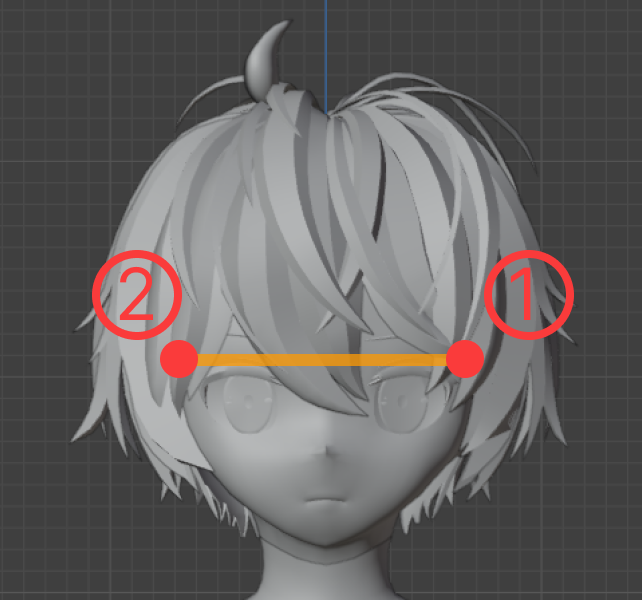
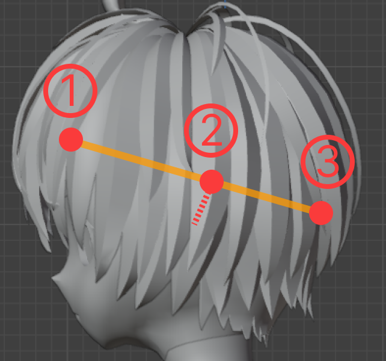
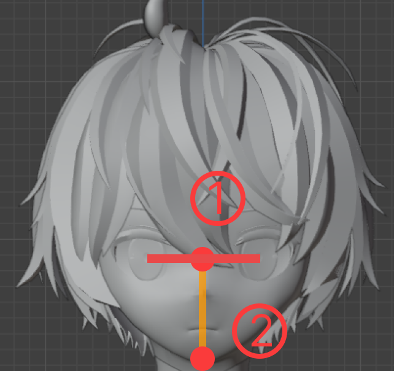
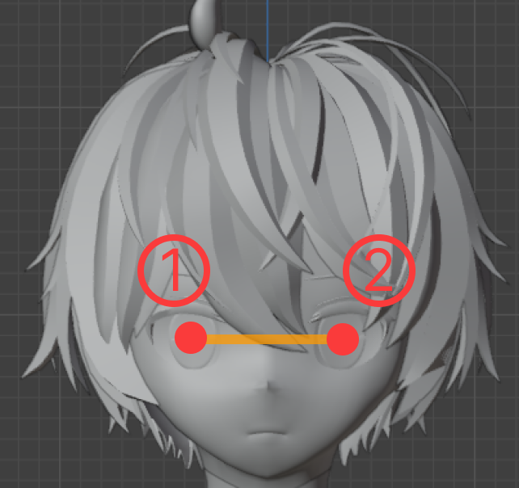
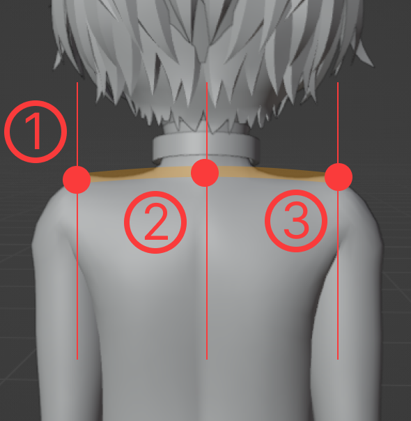

# MEASUREMENT GUIDE

## For MAICRA suit: Body Data Measurement

When ordering a **Kigurumi Bodysuit**, you need to provide your self measurement data.

> [👉 visit **MEASUREMENT GUIDE FOR MAICRA** (notion page)](https://kigland.notion.site/KIG-LAND-MAICRA-Custom-Versions-Measurement-Guide-for-Kigurumi-Bodysuits-f07f069fdfb747e9b68d5ae74018f625?pvs=74)

## For KIGURUMI: Head Data Measurement

When ordering a Kigurumi Mask, you need to provide your self head data.

Before measuring, it is recommended that you prepare a soft ruler and have someone else assist you. If you measure by yourself, it is suggested to do so in front of a mirror.

### Measurement Items

Please measure and record the following data, fill in the [Measurement Results Template](#measurement-result-template), and send it to KigLand customer service.

| No. | Measurement Item   | Schematic Diagram                                                         | Description                                                                                                                                                                         |
| --- | ------------------ | ------------------------------------------------------------------------- | ----------------------------------------------------------------------------------------------------------------------------------------------------------------------------------- |
| 1   | Head Height        |         | Please lean against the wall, record the width of ① and ② respectively, and then measure the distance.                                                                              |
| 2   | Head Width         |          | Please lean against the wall, record the width of ① and ② respectively, and then measure the distance.                                                                              |
| 3   | Head Circumference |  | Measure the circumference around positions ①, ②, and ③. Position ① is the hairline, position ② is about 1cm above the ears, and position ③ is where the back of the head protrudes. |
| 4   | Eye Height         |          | Please measure the distance between ① and ②. ① is parallel to the pupil, and ② is the chin.                                                                                         |
| 5   | Eye Distance       |        | ① and ② are the centers of the pupils in both eyes. Please measure the distance between them.                                                                                       |
| 6   | Height             | /                                                                         | Please measure your height after taking off your shoes. When measuring, please press down your hair.                                                                                |
| 7   | Weight             | /                                                                         | Please measure your weight after taking off your shoes.                                                                                                                             |
| 8   | Shoulder Width     |      | ① and ③ are the two shoulder points, and ② is the location of the cervical spine protrusion. Please measure the distance.                                                           |

### Measurement Result Template

You can fill in the measurement results in the following template and send it to KigLand customer service:

```markdown
Head Height: cm
Head Width: cm
Head Circumference: cm
Eye Height: cm
Eye Distance: cm
Height: cm
Weight: kg
Shoulder Width: cm
```

### Reduce Measurement Error

- When you take measurements, keep your eyes level and don't look up or down;
- Whenever possible, have someone assist with the measurements;
- Use a flexible ruler when measuring head circumference, shoulder width, eye height, and interocular distance.
- Use a rigid ruler to draw lines on the wall when measuring head height and width.
