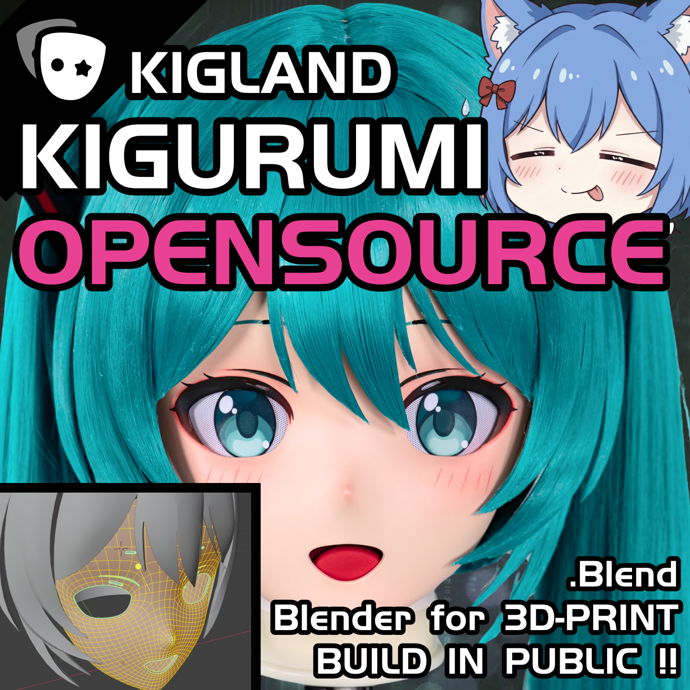
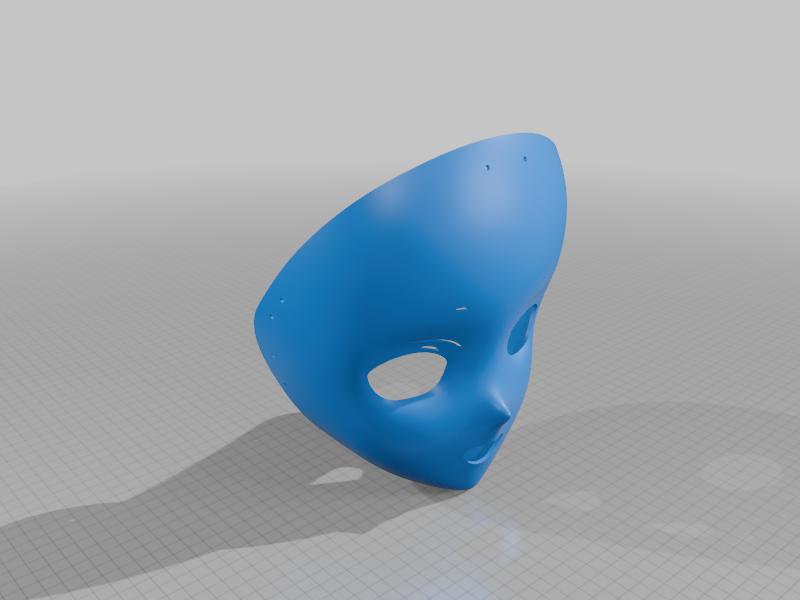

# 开源资源 / Open Source

## KIGLAND TYPE-M 06-1 布线模型 / Blender Mesh

Blender 工程文件，包含完整的布线网格。可以自由编辑面型、调整结构、导出你自己的版本。

Full Blender project with editable mesh. Modify the face shape, tweak the structure, and export your own version.

| 资源 | 链接 |
|------|------|
| 📥 Thingiverse 下载 | [thing:7354352](https://www.thingiverse.com/thing:7354352) |
| 🐦 X / Twitter 发布 | [@Remi_IO](https://x.com/Remi_IO/status/2055960272326852610) |

---

## KIGLAND TYPE-M 06-2 面基底座 / Face Base

STL 文件，可直接切片打印。适合涂装练习、结构研究和快速上手。

STL file, ready to slice and print. Great for painting practice, structure study, and quick start.

| 资源 | 链接 |
|------|------|
| 📥 Thingiverse 下载 | [thing:7351107](https://www.thingiverse.com/thing:7351107) |
| 💬 Reddit 发布 | [r/kigurumi](https://www.reddit.com/r/kigurumi/comments/1ta10wx/i_opensourced_a_cute_stl_face_base_for_kigurumi/) |

> 两个模型均来自 KIGLAND TYPE-M 系列。06-1 适合需要深度定制的玩家，06-2 适合快速打印入门。自由选择。
>
> Both models are from the KIGLAND TYPE-M series. 06-1 is for deep customization (editable mesh), 06-2 for quick print entry. Pick what fits you.
